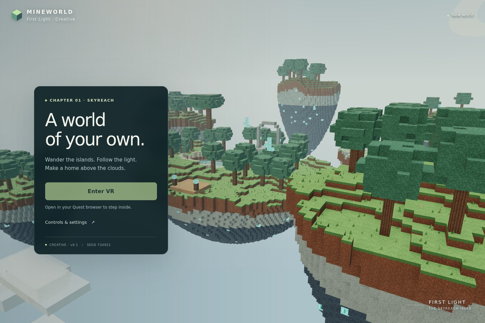

# Mineworld

A Three.js VR voxel game for Meta Quest. The first chapter, **Skyreach**, is a quiet archipelago of floating islands, cedar groves, springs, caves, ruins, and lumen crystals. Gather real resources, make tools at home, restore old passages, and build somewhere worth returning to.

**[Play Mineworld](https://permabulk69420-pixel.github.io/Mineworld/)** · [Build and deployment](https://github.com/permabulk69420-pixel/Mineworld/actions)



## Current game

- Seven deterministic, fully editable islands with original procedural textures.
- **Journey mode is the normal game:** mined blocks enter a finite inventory and placing blocks consumes them.
- Gathering is tool-aware. Cedar and limestone can be gathered with the field tool; lumen crystal requires the quarry pick, while deepstone is deliberately reserved for a later tool tier.
- The first recipe requires **4 cedar + 6 limestone**. Return to the visible field bench at First Light and press **Y** to deliberately craft the quarry pick; merely walking home does not craft it for you.
- With the quarry pick, gather **6 lumen crystals** and carry them to the Old Arch. The restored arch becomes a real portal to Lumen Hollow, where a paired waystone provides a persistent route home.
- Different materials have different hold-to-gather times, with visible targeting progress and blocked-material feedback.
- Walking, collision, single-block stepping, jumping, teleporting, and head-relative VR locomotion.
- Quest WebXR: tracked controllers, smooth or snap turning, teleport arc, a changing hand tool, and a wrist inventory/objective display.
- Automatic saves in the current browser, plus JSON export/import for backups and device transfers.
- Chunk meshes with hidden-face removal and vertex ambient occlusion; instanced foliage and debris.
- GitHub Actions tests, builds, captures screenshots, and deploys to GitHub Pages.

Creative mode remains available as an explicit development/free-building mode with `?creative=1`; it is not the product default. Flight and unlimited placement live there instead of weakening Journey progression.

## Controls

| Action | Quest controllers |
| --- | --- |
| Move | Left stick |
| Look / turn | Head / right stick |
| Gather / mine | Hold right trigger |
| Place selected material | Hold right grip |
| Material | X next / left grip previous |
| Craft / use | Y |
| Jump | A |
| Teleport | Hold left trigger, aim at ground, release |
| Return home / settings | Leave VR using the headset control, then open Controls & settings |

The wrist shows the selected material, how many you have, your current tool, and the current Journey objective. Material cycling skips empty stacks. Flight is disabled in Journey mode. In explicit creative mode, Y toggles flight and A/B move vertically.

On Quest, open the play link **in the headset browser** and choose **Enter VR**. Grant the requested immersive-session permission and use controllers. Hand tracking is not implemented. Smooth turning is the default; snap turning is available in Controls & settings before entering VR.

## Saves

Saves belong to a browser and device. They do not sync to GitHub. Use **Controls & settings → Export world** to keep a backup or carry a build to another headset. Importing asks before replacing the current device's world. Unsupported or corrupt saves are preserved rather than overwritten.

The seed and terrain generator version are stored with coordinate-based block edits. Journey inventory, tool state, and progression are stored alongside them. Generator version 1 remains a compatibility contract so existing worlds keep their original terrain.

## Development

Node 22.12+:

```sh
npm ci
npm run dev
npm run check
```

The game has no runtime API, CDN, account, or key dependency. The Three.js bundle and all assets ship with the game. One block is 0.75 metres. The finite build region is approximately 190 × 190 metres, with a vertical limit of 96 metres.

For checks without a headset, append `?test=1` to the game URL. This exposes **Start desktop test** and its control reference. It remains a development aid; the public product is VR only, with no phone gameplay controls. Append `?creative=1` only when deliberately testing unrestricted building/flight.

For browser regression checks (the same checks run in Actions):

```sh
npx playwright install --with-deps chromium
npm run build
npm run test:browser
```

Screenshots and a text report are produced in `artifacts/`. Browser tests exercise the production build under `/Mineworld/` so relative asset paths are checked too. The software renderer's frame rate is **not** a Quest benchmark.

Push builds also keep the latest screenshot set and report on the `previews` branch, including failure captures. This branch contains test output only and never deploys the game.

## Deployment

This repository deploys through **GitHub Actions → GitHub Pages**. Code pushes to `main` run world/physics/save/game tests, build, run the browser check, and deploy. Documentation-only pushes skip deployment. Pull requests run validation without publishing. The workflow can also be run manually from Actions.

For a new fork, select **Settings → Pages → GitHub Actions** as the source once. Browser sign-in is not required for routine code updates through the GitHub connection.

See [the direction](docs/DIRECTION.md) and [the development journal](docs/DEVELOPMENT.md) before extending the game.
